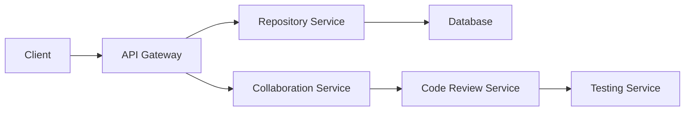

# 🚀 GitGuru
[](https://travis-ci.org/mehrshud/GitGuru)
[](https://github.com/mehrshud/GitGuru/blob/master/LICENSE)
[](https://github.com/mehrshud/GitGuru/stargazers)
[](https://github.com/mehrshud/GitGuru/tags)

## Introduction
GitGuru is a powerful tool built with Python and pip, designed to simplify repository management, change tracking, collaboration, and code review for developers. With its intuitive interface and robust features, GitGuru streamlines the development process, making it easier for teams to work together efficiently.

## Features
* **Repository Structure Management** 📁: Organize your git repository with ease, including automatic folder creation and file management.
* **Change Tracking** 🔍: Monitor changes to your codebase in real-time, with features like commit tracking and branch monitoring.
* **Collaboration Tools** 🤝: Enhance teamwork and communication among developers, including real-time commenting and @mentions.
* **Code Review Integration** 📝: Streamline the code review process with automated testing and review assignments.

## System Architecture
The following Mermaid diagram illustrates the system architecture of GitGuru:

This architecture enables seamless communication between the client, API gateway, and various services, ensuring efficient data processing and storage.

## Quick Start
Get started with GitGuru in minutes:
1. Install the GitGuru CLI using pip: `pip install gitguru`
2. Initialize a new repository or link an existing one: `gitguru init` or `gitguru link`
3. Start tracking changes and collaborating with your team: `gitguru track`

## Installation
To install GitGuru, run the following command:
```bash
pip install gitguru
```
Alternatively, you can download the latest release from the [releases page](https://github.com/mehrshud/GitGuru/releases).

## Usage Examples
* Initialize a new repository: `gitguru init`
* Link an existing repository: `gitguru link`
* Start tracking changes: `gitguru track`
* Create a new branch: `gitguru branch create <branch-name>`
* Assign a code review: `gitguru review assign <reviewer> <pull-request>`

## API Documentation
View the [API documentation](https://github.com/mehrshud/GitGuru/blob/master/docs/api.md) for more information on using the GitGuru API.

## Contributing Guidelines
We welcome contributions to GitGuru! Please see the [contributing guidelines](https://github.com/mehrshud/GitGuru/blob/master/CONTRIBUTING.md) for more information.

## Comparison with Other Tools
The following table compares the features of GitGuru with other popular git management tools:

| Feature | GitGuru | GitLab | GitHub | Bitbucket |
| --- | --- | --- | --- | --- |
| Repository Structure Management | 📁 | 📁 | 📁 | 📁 |
| Change Tracking | 🔍 | 🔍 | 🔍 | 🔍 |
| Collaboration Tools | 🤝 | 🤝 | 🤝 | 🤝 |
| Code Review Integration | 📝 | 📝 | 📝 | 📝 |
| Automated Testing | 🤖 | 🤖 | 🤖 | 🤖 |
| Real-time Commenting | 💬 | 💬 | 💬 | 💬 |

## Code Examples
Here are some code examples to demonstrate the usage of GitGuru:
```python
import gitguru

# Initialize a new repository
gitguru.init()

# Link an existing repository
gitguru.link("https://github.com/mehrshud/GitGuru")

# Start tracking changes
gitguru.track()

# Create a new branch
gitguru.branch.create("feature/new-feature")

# Assign a code review
gitguru.review.assign("mehrshud", "https://github.com/mehrshud/GitGuru/pull/1")
```
These examples illustrate the simplicity and ease of use of GitGuru's API.

## License
GitGuru is licensed under the [MIT License](https://github.com/mehrshud/GitGuru/blob/master/LICENSE).

## Author
GitGuru was created by [mehrshud](https://github.com/mehrshud).

## Website
Learn more about GitGuru and our other projects at [https://www.omnilertlab.com](https://www.omnilertlab.com).

## Community
Join our community on GitHub to stay up-to-date with the latest developments and to contribute to the project:
* [GitHub Repository](https://github.com/mehrshud/GitGuru)
* [GitHub Issues](https://github.com/mehrshud/GitGuru/issues)
* [GitHub Pull Requests](https://github.com/mehrshud/GitGuru/pulls)

## Roadmap
Our roadmap for GitGuru includes the following features and improvements:
* Enhanced collaboration tools, including real-time video conferencing and screen sharing
* Improved code review integration, including automated testing and review assignments
* Expanded repository structure management, including automatic folder creation and file management
* Integration with popular development tools, including Jira and Trello

We welcome your feedback and suggestions on our roadmap and look forward to continuing to improve and expand GitGuru in the future.